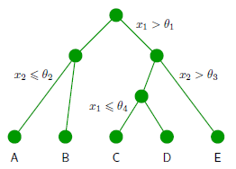
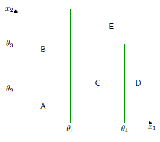

## Prerequisites

- Entropy and KL divergence
- Loss functions: squared error, log loss
- Basic understanding of classification and regression
- Supervised learning pipeline: design matrix $X$, target vector $t$

## Key Terminology

- **Decision tree**: A hierarchical model that partitions the input space and predicts a constant output in each region.
- **Axis-aligned split**: A decision boundary that divides data by thresholding a single feature.
- **Gini index**: A measure of class impurity; low when a region contains mostly one class.
- **Entropy**: Measures uncertainty or disorder in a class distribution.
- **CART**: Classification and Regression Trees (Breiman et al.). Uses squared error (regression) and Gini index (classification).
- **ID3**: Algorithm using information gain (reduction in entropy) to grow classification trees.
- **C4.5**: Extension of ID3 with pruning and support for continuous features.
- **Design matrix**: Matrix $X$ of shape $N \times D$; each row is a data point, each column a feature.
- **Missing values**: Data entries that are unavailable, handled via surrogate splits or imputation.

## Why It Matters

Tree-based models are interpretable and versatile for both regression and classification. They serve as base learners in ensemble methods (e.g., random forests, boosting), and their greedy construction principles extend to many structured models. Their axis-aligned partitions are simple yet powerful, especially when ensembled.

## Key Ideas

### Tree Model Structure

We divide the input space into $M$ disjoint regions $\{R_1, \dots, R_M\}$, and make predictions via:

$$
y(\mathbf{x}) = \sum_{j=1}^{M} y_j \cdot \mathbb{I}(\mathbf{x} \in R_j)
$$




---

## Regression Trees

For regression, we use squared loss. In region $R_\tau$, the prediction is:

**Equation 14.29 (mean target in region):**

$$
y_\tau = \frac{1}{N_\tau} \sum_{\mathbf{x}_n \in R_\tau} t_n
$$

**Equation 14.30 (error in region):**

$$
Q_\tau(T) = \sum_{\mathbf{x}_n \in R_\tau} (t_n - y_\tau)^2
$$

**Total cost with regularization (Equation 14.31):**

$$
C(T) = \sum_{\tau=1}^{|T|} Q_\tau(T) + \lambda |T|
$$

where $|T|$ is the number of terminal nodes (leaves), and $\lambda$ penalizes complexity.

---

## Classification Trees

Let $p_{\tau k}$ be the proportion of class $k$ in region $R_\tau$.

- **Entropy impurity (Equation 14.32):**

$$
Q_\tau(T) = -\sum_{k=1}^{K} p_{\tau k} \ln p_{\tau k}
$$

- **Gini index (Equation 14.33):**

$$
Q_\tau(T) = \sum_{k=1}^{K} p_{\tau k} (1 - p_{\tau k})
$$

**Note:** Both are minimized when the region is pure (i.e., all points belong to one class).

---

## Splitting Criteria and Algorithms

| Algorithm | Criterion            | Handles Continuous? | Handles Missing?   |
| --------- | -------------------- | ------------------- | ------------------ |
| CART      | Gini / Squared Error |  Yes               |  Yes (surrogates) |
| ID3       | Entropy (Info Gain)  |  No                |  No               |
| C4.5      | Gain Ratio           |  Yes               |  Yes              |

---

## Pseudocode: Tree Construction (Binary Splits)

```python
# Pseudocode !
def GrowTree(data, depth, max_depth):
    if stopping_condition(data, depth, max_depth):
        return LeafNode(predict=mean_or_majority(data))

    best_feature, best_threshold = FindBestSplit(data)
    left, right = PartitionData(data, best_feature, best_threshold)

    return DecisionNode(
        feature=best_feature,
        threshold=best_threshold,
        left=GrowTree(left, depth + 1, max_depth),
        right=GrowTree(right, depth + 1, max_depth)
    )
```

```python
def FindBestSplit(data, features, loss_fn):
    best_feature = None
    best_threshold = None
    best_score = float('inf')

    for feature in features:
        values = sorted(set(data[feature].dropna()))
        thresholds = (
            [(values[i] + values[i + 1]) / 2 for i in range(len(values) - 1)]
            if is_continuous(feature)
            else all_nontrivial_subsets(values)
        )

        for threshold in thresholds:
            left, right = split_data(data, feature, threshold)

            if not left or not right:
                continue  # Skip invalid splits

            score = loss_fn(left) + loss_fn(right)
            if score < best_score:
                best_feature = feature
                best_threshold = threshold
                best_score = score

    return best_feature, best_threshold
```

**Split Handling:**

- **Continuous features**: sorted thresholds.
- **Categorical (nominal)**: try subsets or groupings.
- **Ordinal**: treated as numeric.
- **Missing values**:
  - Use surrogate splits (CART)
  - Or impute (mean/mode)

---

## Interpretability of Trees

- **Readable rules**: Each path corresponds to a logical rule.
- **Transparency**: Easy to visualize structure and reasoning.
- **Limitations**:
  - Sensitive to small perturbations.
  - Axis-aligned: can't model diagonal boundaries unless deep.

### Stability Caveat

Although decision trees are often valued for their interpretability, they are also highly **unstable**.  
Small changes in the training data — even the removal or relabeling of a single point — can lead to entirely different tree structures.  
This sensitivity arises from the greedy nature of split selection, and is a key motivation for ensemble methods like bagging, which aim to **stabilize** predictions by averaging over many trees trained on resampled data.

---

## EXample Design Matrix (Mixed Feature Types)

| ID  | Weather (Nominal) | Temperature (Continuous) | Humidity (Ordinal: Low < Medium < High) | Play (Target) |
| --- | ----------------- | ------------------------ | --------------------------------------- | ------------- |
| 1   | Sunny             | 85                       | High                                    | 0             |
| 2   | Sunny             | 80                       | High                                    | 0             |
| 3   | Overcast          | 83                       | Medium                                  | 1             |
| 4   | Rainy             | 70                       | High                                    | 1             |
| 5   | Rainy             | 68                       | Medium                                  | 1             |
| 6   | Rainy             | 65                       | Low                                     | 0             |
| 7   | Overcast          | 64                       | Low                                     | 1             |
| 8   | Sunny             | 72                       | Medium                                  | 0             |

### Feature Summary

- **Weather**: Nominal (`Sunny`, `Overcast`, `Rainy`)
- **Temperature**: Continuous
- **Humidity**: Ordinal (Low = 1, Medium = 2, High = 3)
- **Target – Play**: Binary classification (0 = Don't Play, 1 = Play)
  
## Relevant Figures from PRML

- **Figure 14.3**:  
    
  Shows 2-level binary tree with axis-aligned boundaries.
- **Figure 14.4**:  
  
   Depicts regression tree fitting piecewise constant model to data.
