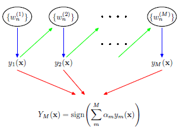
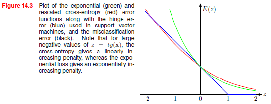

## Prerequisites

- Supervised learning and generalization error
- Basic probability and expectations over distributions
- Bias-variance decomposition
- Gradient descent and function approximation
- Classification loss functions (0–1 loss, exponential loss)

## Key Terminology

- **Committee**: A set of models whose outputs are combined to make a final prediction.
- **Bagging**: Short for bootstrap aggregating; reduces variance by averaging models trained on resampled datasets.
- **Boosting**: An additive modeling framework that builds a strong learner by sequentially correcting weak learners.
- **Bayesian model averaging (BMA)**: A principled approach to combining models weighted by their posterior probabilities.
- **Posterior predictive distribution**: The expected prediction averaged over the posterior distribution of model parameters.
- **Additive model**: A prediction function expressed as a sum of individual component models.
- **Forward stagewise additive modeling**: A greedy procedure that adds one model at a time to minimize loss.

## Why It Matters

Ensemble methods like bagging and boosting consistently outperform individual models by combining multiple hypotheses. Understanding how committees reduce variance (bagging) or bias (boosting) is foundational to both classical and modern machine learning—especially tree-based methods and large-scale classifiers.

---

## 14.2 Committee of Models

### Averaging Outputs

Given $L$ models $y^{(l)}(\mathbf{x})$, a committee average is:

$$
y(\mathbf{x}) = \frac{1}{L} \sum_{l=1}^L y^{(l)}(\mathbf{x})
$$

If each model has uncorrelated zero-mean error with variance $\sigma^2$, the variance of the ensemble prediction is:

$$
\text{Var}(y) = \frac{1}{L} \sigma^2
$$

So **variance drops linearly with the number of models**, assuming independence.

### Bootstrap Aggregating (Bagging)

- Generate $L$ bootstrap datasets by sampling **with replacement** from the original training data.
- Each dataset has the same size $N$, but typically contains duplicates and omits some examples.
- Train a separate model on each bootstrap sample.
- Average the predictions (for regression) or take a majority vote (for classification).

Bootstrapping injects variability among models, enabling bagging to reduce variance without increasing bias. On average, a bootstrap sample contains about 63% of the original examples (the rest are left out-of-bag and can be used for validation).

**Why it works**:

- Reduces variance without increasing bias
- Most effective with high-variance models (e.g., unpruned decision trees)

---

### Bayesian Model Averaging (BMA)

Given a posterior $p(\mathbf{w} \mid \mathcal{D})$ over model parameters:

$$
p(t \mid \mathbf{x}, \mathcal{D}) = \int p(t \mid \mathbf{x}, \mathbf{w}) p(\mathbf{w} \mid \mathcal{D}) \, d\mathbf{w}
$$

This is called the **posterior predictive distribution**.

**Notes**:

- The Bayesian average is optimal under expected loss
- Intractable in high dimensions
- Approximated in practice (e.g., via MAP or ensemble sampling)

---

## 14.3 Boosting

### Additive Models

We define the function:

$$
f_M(\mathbf{x}) = \sum_{m=1}^M \beta_m h_m(\mathbf{x})
$$

Each $h_m$ is a base learner, and $\beta_m$ is its coefficient.

---

### Forward Stagewise Additive Modeling

At each stage $m$, we solve:

$$
(\beta_m, h_m) = \arg\min_{\beta, h} \sum_{n=1}^N \mathcal{L}\left(t_n, f_{m-1}(\mathbf{x}_n) + \beta h(\mathbf{x}_n)\right)
$$

Update:
$$
f_m(\mathbf{x}) = f_{m-1}(\mathbf{x}) + \beta_m h_m(\mathbf{x})
$$

No need to re-optimize previous components. This is **greedy**, **functional gradient descent**.

At each stage, the new component $h_m(\mathbf{x})$ is chosen to correct the errors of the current model.  
In squared error regression, this corresponds to learning the residuals:
$$
r_n^{(m)} = t_n - f_{m-1}(\mathbf{x}_n)
$$
More generally, in forward stagewise modeling, each $h_m$ approximates the **functional gradient** of the loss with respect to $f_{m-1}(\mathbf{x})$.

---

### AdaBoost

AdaBoost is a boosting algorithm specialized for **binary classification** with labels $t_n \in \{-1, +1\}$.  
It builds an additive model of the form:

$$
f_M(\mathbf{x}) = \sum_{m=1}^M \beta_m h_m(\mathbf{x})
$$

where each $h_m(\mathbf{x})$ is a weak classifier and $\beta_m$ is its associated weight.  
The final prediction is $\text{sign}(f_M(\mathbf{x}))$.

---

#### Loss Function

AdaBoost corresponds to minimizing the **exponential loss**:

$$
\mathcal{L}(t, f(\mathbf{x})) = \exp(-t f(\mathbf{x}))
$$

This loss increases **rapidly** when $f(\mathbf{x})$ has the wrong sign — i.e., when the model is confident and wrong.

---

#### Algorithm Overview (Functional Perspective)

At each iteration $m$, AdaBoost performs the following steps:

1. **Define weights** per-sample based on current ensemble predictions:

   $$
   w_n^{(m)} = \exp\left( -t_n f_{m-1}(\mathbf{x}_n) \right)
   $$

   These weights emphasize examples that were misclassified in previous rounds.

2. **Train a weak classifier** $h_m(\mathbf{x})$ to minimize the weighted classification error:

   $$
   \epsilon_m = \frac{\sum_{n: h_m(\mathbf{x}_n) \ne t_n} w_n^{(m)}}{\sum_n w_n^{(m)}}
   $$

   In practice, the weak learner $h_m$ is often a decision stump (a tree of depth 1 or 2), trained on the **weighted dataset** defined by $w_n^{(m)}$.  
   While AdaBoost minimizes exponential loss globally, the stump itself may use **weighted cross-entropy** or **Gini impurity** at its node splits, treating $w_n^{(m)}$ as per-example importance weights.  
   This allows the weak classifier to focus on the same hard examples emphasized by the exponential loss.

3. **Compute model weight**:

   $$
   \beta_m = \frac{1}{2} \ln\left( \frac{1 - \epsilon_m}{\epsilon_m} \right)
   $$

   This quantifies the reliability of $h_m$ — better classifiers receive larger weights.

4. **Update the example weights**:

   $$
   w_n^{(m+1)} = w_n^{(m)} \cdot \exp\left( -\beta_m t_n h_m(\mathbf{x}_n) \right)
   $$

   - If $h_m(\mathbf{x}_n) = t_n$: weight decreases
   - If $h_m(\mathbf{x}_n) \ne t_n$: weight increases

5. **Normalize** the weights so they sum to 1:
   $$
   w_n^{(m+1)} \leftarrow \frac{w_n^{(m+1)}}{\sum_n w_n^{(m+1)}}
   $$

---

### Interpretation

AdaBoost adapts the training distribution to focus on difficult examples — each weak learner is trained on a different distribution shaped by previous mistakes.  
Over iterations, the ensemble function $f_M(\mathbf{x})$ approximates a classifier that minimizes the exponential loss.

---

## Sidebar: Boosting vs Bagging

|               | Bagging                           | Boosting                            |
|---------------|-----------------------------------|-------------------------------------|
| Goal          | Reduce variance                   | Reduce bias                         |
| Training      | Parallel (independent models)      | Sequential (depends on previous)    |
| Emphasis      | Equal weighting                   | Harder samples get more attention   |
| Base Learners | Typically full models             | Typically weak learners (e.g., stumps) |
| Output        | Average or majority vote          | Weighted sum                        |

---

## Relevant Figures from PRML

- **Figure 14.1**: Posterior predictive model averaging
- **Figure 14.2**: AdaBoost decision boundary evolution
