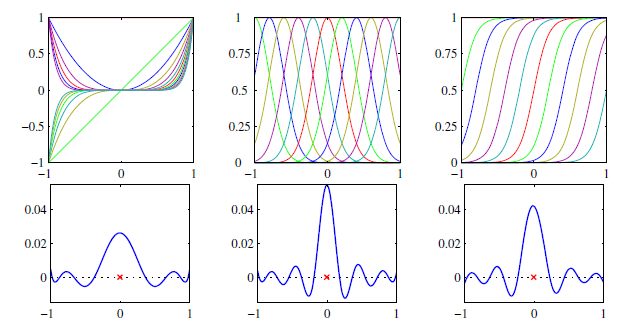

# Lecture Notes: PRML Chapter 6 – Section 6.2 Constructing Kernels

## Prerequisites
- Inner products and Mercer’s theorem (positive‑semidefiniteness)  
- Feature‑space mappings $\phi(x)$ and basis functions $\phi_i(x)$ 
- Familiarity with common kernels (linear, polynomial, RBF)  

## Key Terminology
- **Feature map** $\phi(x)$: Transforms input x into a (possibly infinite‑dimensional) feature space.  
- **Basis functions** $\phi_i(x)$: Coordinates of $\phi(x)$, used to build kernels via  
  $$k(x,x') = \sum_{i=1}^M \phi_i(x)\,\phi_i(x')\,. \tag{6.10}$$   
- **Valid kernel (Mercer kernel)**: A function k for which every Gram matrix $K_{nm}=k(x_n,x_m)$ is positive‑semidefinite.  
- **Closure properties**: Operations (sum, product, scaling, composition) that preserve kernel validity (Equations 6.13–6.22).  
- **Stationary kernel**: Depends only on $x - x'$.  
- **Homogeneous/RBF kernel**: Depends only on $\|x - x'\|$, e.g.\ Gaussian kernel (6.23).  

## Why It Matters
- **Custom similarity measures**: By constructing kernels directly, we can tailor similarity functions to data types (vectors, sets, strings) without explicit $\phi(x)$.  
- **Infinite‑dimensional features**: Valid kernels let us work implicitly in very high or infinite feature spaces.  
- **Modular design**: Closure properties (sums, products, exponentials) enable building complex kernels from simpler ones.

## Key Ideas

1. **Feature‑map construction**  
   - Specify $\phi(x)$ (e.g.\ monomials, Gaussians, sigmoids) and compute  
     $$k(x,x') = \sum_i \phi_i(x)\,\phi_i(x')\,. \tag{6.10}$$  
   - Example: Quadratic kernel  
     $$k(x,z) = (x^\top z)^2$$  
     expands to $\phi(x)$ = $(x_1^2,\sqrt{2}x_1x_2,x_2^2)$, yielding Equation (6.12). 

2. **Mercer’s condition**  
   - A function k is a valid kernel if and only if every finite Gram matrix is positive‑semidefinite.  
   - No need to find $\phi(x)$ explicitly—test via eigenvalues of K.

3. **Closure properties for building kernels**  
Given valid kernels $k_1(x, x')$ and $k_2(x, x')$, the following new kernels will also be valid:

$$
\begin{aligned}
k(x, x') &= c\,k_1(x, x') \hspace{2.6cm} \text{(6.13)} \\
k(x, x') &= f(x)\,k_1(x, x')\,f(x') \hspace{1.3cm} \text{(6.14)} \\
k(x, x') &= q\left(k_1(x, x')\right) \hspace{2.2cm} \text{(6.15)} \\
k(x, x') &= \exp\left(k_1(x, x')\right) \hspace{2.2cm} \text{(6.16)} \\
k(x, x') &= k_1(x, x') + k_2(x, x') \hspace{1.3cm} \text{(6.17)} \\
k(x, x') &= k_1(x, x')\,k_2(x, x') \hspace{1.9cm} \text{(6.18)} \\
k(x, x') &= k_3\left(\phi(x), \phi(x')\right) \hspace{2cm} \text{(6.19)} \\
k(x, x') &= x^\top A x' \hspace{3.8cm} \text{(6.20)} \\
k(x, x') &= k_a(x_a, x_a') + k_b(x_b, x_b') \hspace{1cm} \text{(6.21)} \\
k(x, x') &= k_a(x_a, x_a')\,k_b(x_b, x_b') \hspace{1cm} \text{(6.22)} \\
\end{aligned}
$$

**Where:**
- $c > 0$ is a constant  
- $f(\cdot)$ is any function  
- $q(\cdot)$ is a polynomial with nonnegative coefficients  
- $\phi(x)$ maps $x$ to $\mathbb{R}^M$  
- $k_3(\cdot, \cdot)$ is a valid kernel on $\mathbb{R}^M$  
- $A$ is a symmetric positive semidefinite matrix  
- $x = (x_a, x_b)$  
- $k_a$, $k_b$ are valid kernels on their respective spaces  

## Common Kernels

- **Polynomial Kernel**:  
  The general form is  
  $$
  k(x, x') = (x^\top x' + c)^M
  $$  
  which corresponds to a feature mapping $\phi(x)$ that includes **all monomials of degree up to $M$**. For example, in the case of 2D input and $M = 2$, we have:
  - Kernel: $k(x, x') = (x^\top x' + 1)^2$
  - Feature map:
    $$
    \phi(x) = \left(1, \sqrt{2}x_1, \sqrt{2}x_2, x_1^2, \sqrt{2}x_1x_2, x_2^2\right)
    $$
    which ensures that $\phi(x)^\top \phi(x') = k(x, x')$.
  
- **Gaussian (RBF) Kernel**:  
  $$
  k(x, x') = \exp\left(-\frac{\|x - x'\|^2}{2\sigma^2}\right) \tag{6.23}
  $$  
  This kernel corresponds to a feature space of **infinite dimensionality**. We can see this by expanding the exponential using the Taylor series:
  $$
  \exp(x^\top x') = \sum_{n=0}^\infty \frac{(x^\top x')^n}{n!}
  $$
  implying that the implicit feature map $\phi(x)$ includes monomials of all degrees (i.e., it spans an infinite basis of functions). This infinite expansion cannot be expressed in closed form as a finite-dimensional $\phi(x)$.

- **Set Kernels**:  
  For inputs that are sets, a valid kernel can be defined by:
  $$
  k(A_1, A_2) = 2^{|A_1 \cap A_2|}
  $$
  This measures similarity based on the size of the set intersection. It is valid because it corresponds to an inner product in a $2^{|S|}$-dimensional binary feature space indexed by subsets.

- **Fisher Kernel**:  
  Based on a generative model $p(x|\theta)$, the **Fisher kernel** defines similarity between two inputs via their **Fisher scores**:
  $$
  g(\theta, x) = \nabla_\theta \ln p(x|\theta)
  $$
  These are gradients of the log-likelihood with respect to the model parameters $\theta$, representing how sensitive the model is to changes in parameters given input $x$.

  The kernel is defined as:
  $$
  k(x, x') = g(\theta, x)^\top F^{-1} g(\theta, x')
  $$
  where $F$ is the **Fisher information matrix**:
  $$
  F = \mathbb{E}_x\left[g(\theta, x) g(\theta, x)^\top\right]
  $$
  This matrix is a covariance matrix of the gradients and ensures invariance under smooth reparameterizations of $\theta$. In practice, $F$ is often approximated using sample averages, or even dropped entirely:
  $$
  k(x, x') = g(\theta, x)^\top g(\theta, x')
  $$

> This is a niche but interesting kernel;

## Relevant Figures from PRML
-   
  **Figure 6.1** (p. 295): Shows three columns of basis functions (polynomials, Gaussians, sigmoids) paired with their induced kernels $k(x,x')$ plotted versus x for fixed $x'=0$. Demonstrates how different $\phi$‑choices produce different similarity measures.  

## Learning Outcomes

After studying Section 6.2 “Constructing Kernels,” students will be able to:

1. **Explain the feature‑map definition of a kernel** via  
   $$
   k(x,x') = \sum_{i=1}^M \phi_i(x)\,\phi_i(x').
   $$
2. **State Mercer’s condition**: a kernel is valid if every Gram matrix is positive‑semidefinite.  
3. **Apply closure properties** (scaling, sums, products, exponentials, function–kernel–function) to build new kernels.  
4. **Identify common kernel families**: polynomial, Gaussian RBF, set kernels, Fisher kernels.  
5. **Derive explicit feature maps** for simple polynomial kernels (e.g.\ $(x^\top z)^2$ or $(x^\top z + c)^2$).  
6. **Test kernel validity** by reasoning about Gram‑matrix positive‑semidefiniteness without explicit $\phi(x)$.  
7. **Construct kernels from generative models**, including mixture‑based and Fisher kernels.  
8. **Distinguish stationary kernels** (depend on $x - x'$) from general kernels.  
9. **Combine kernels** modularly using the listed construction rules (Equations 6.13–6.22).  
10. **Design simple domain‑specific kernels**, such as set‑intersection kernels.  
