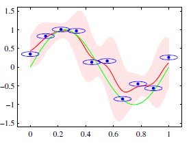

# Lecture Notes: PRML Chapter 6 – Section 6.3 Radial Basis Function Networks

## Prerequisites
- Basis function models (linear in weights)
- Kernel methods and dual representations
- Concepts from regularization theory
- Kernel density estimation and conditional expectation

## Key Terminology

- **Radial basis function (RBF)**: A basis function $\phi_j(x) = h(\|x - \mu_j\|)$ that depends only on the distance from a center $\mu_j$.
- **Exact interpolation**: A model that satisfies $f(x_n) = t_n$ for all training points.
- **Nadaraya–Watson model**: A kernel regression model in which the predicted output is a *weighted average of the training targets*, where the weights are determined by *normalized kernel basis functions centered at each training point*.  
- **Normalized RBF**: A radial basis function scaled to ensure that all kernel weights for a test input sum to 1.
- **Equivalent kernel**: The set of weights applied to training targets when expressing the model’s output as a linear combination of them.
  
## Why It Matters

Radial basis function networks (RBFNs) form a class of neural-like architectures that:
- Provide a bridge between interpolation, kernel methods, and probabilistic models.
- Serve as a basis for **kernel regression**, **Parzen estimators**, and **support vector machines**.
- Provide localized, interpretable representations that respond to nearby training data.

> **How are they neural-like?**  They involve _input_ laye, an RBF layer, and out output layer (that is linear) like a 2-layer neural network. 

RBFs also appear as the solution to **regularization problems**, **noisy input inference**, and **kernel density estimation**, showing their deep theoretical importance.

## Key Ideas

### 1. **RBF Networks as Interpolators**
- In the simplest case, we define the model as
  $$
  f(x) = \sum_{n=1}^N w_n\,h(\|x - x_n\|)
  $$
  with one basis function centered at each training point.
- Solving for the weights $w_n$ using least squares leads to a function that **interpolates** the training data exactly.
- This is undesirable in the presence of noise, as it leads to overfitting.

### 2. **Normalized vs. Unnormalized Kernels**
- Normalizing the kernel ensures that the weights sum to 1:
  $$
  \sum_n k(x, x_n) = 1
  $$
- This helps prevent the output from collapsing to zero in low-density regions.

- Geometrically, this ensures that all predictions are **barycentric combinations** of the targets — that is, weighted averages where the weights are non-negative and sum to 1.
- This means predictions lie within the **convex hull of the training targets**, a key property of smooth and stable interpolation.

### 3. **Noisy Inputs and the Nadaraya–Watson Model**
Another point of view - RBFs arise from uncertainty in position when "looking up" targets.

Assume input points $x_n$ are corrupted by noise: $x_n + \xi$, where $\xi$ is a random variable with density $\nu(\xi)$.

We minimize the expected squared loss:
$$
E = \frac{1}{2} \sum_{n=1}^N \int \left\{ y(x_n + \xi) - t_n \right\}^2 \nu(\xi)\, d\xi
$$

The optimal solution is:
$$
y(x) = \sum_{n=1}^N t_n\, h(x - x_n),
$$
with basis functions defined by a **normalized noise distribution**:
$$
h(x - x_n) = \frac{\nu(x - x_n)}{\sum_{m=1}^N \nu(x - x_m)}
$$

- $\nu(\cdot)$ is the input noise density  
- $h(x - x_n)$ is a basis function centered at $x_n$  
- **Weights sum to 1** (note the denominator)$\rightarrow$ local averaging

> **NOTE:** If the targets $t_n$ are all 1, then the Nadaraya–Watson model reduces to a **Parzen window density estimate**:
> $$
> y(x) = \frac{1}{N} \sum_{n=1}^N K(x - x_n)
> $$
> This shows that Nadaraya–Watson is a **generalization of K-nearest neighbors** — it performs a **soft, kernel-weighted average** of nearby targets instead of a hard average over the $K$ closest points.

### 4. **Computational Tradeoffs**

- If one radial basis function is centered at each training point, the model has $O(N)$ basis functions and becomes **computationally expensive** at prediction time — especially when $N$ is large.
- To reduce cost, we can use **fewer centers**, selected by:

  - **Random subset selection**:  
    Just sample $M \ll N$ training points at random to use as centers.

  - **K-means clustering**:  
    Fit a K-means model on the inputs; use the $M$ cluster centroids as RBF centers. Each center summarizes a region of the input space.

  - **Orthogonal least squares (OLS) selection**:  
    A **greedy algorithm** that adds one center at a time.  
    At each step, it picks the training point whose basis function, when added, **most reduces the mean squared error** on the training data.  
    This avoids redundancy and yields a sparse, interpretable model.

- Another strategy is to **fix the basis function centers without using any training data** — e.g., placing them on a **regular grid** or **predefined lattice** in input space.

  - This is common in low-dimensional inputs where the domain is known in advance (e.g., images or spatial coordinates).
  - The centers are not learned or adapted — they stay the same regardless of the data.

- Once the centers are chosen (via data or design), the model becomes:
  $$
  y(x) = \sum_{j=1}^M w_j\, \phi_j(x), \quad \text{where } \phi_j(x) = h(\|x - \mu_j\|)
  $$
  Here:
  - Each $\mu_j$ is a chosen center
  - $h(\cdot)$ is the radial basis function (e.g., a Gaussian)

- The weights $w_j$ can then be learned by solving a **linear least squares problem**:
  $$
  \min_w \; \| \Phi w - t \|^2
  $$
  where:
  - $\Phi_{nj} = \phi_j(x_n)$ is the **design matrix**: how each input $x_n$ activates each basis function
  - $t = [t_1, \dots, t_N]^\top$ are the target values

## Relevant Figures from PRML

-   
**Figure 6.2**: Shows the difference between unnormalized and normalized RBFs. Normalized RBFs form a **partition of unity**—each test point is influenced mostly by nearby training points.
-   
**Figure 6.3**: Visualization of Nadaraya–Watson kernel regression using Gaussian kernels for noisy sine wave data. The red curve shows the conditional mean; the shaded region shows 2$\sigma$ uncertainty; each blue bump is a Gaussian kernel centered at a training point.

---

# Learning Outcomes

After studying Section 6.3, students will be able to:

1. **Define radial basis functions** and explain why they depend only on $\|x - \mu_j\|$.  
2. **Construct an interpolating model** using RBFs centered on training data.  
3. **Describe the Nadaraya–Watson model** and derive it from noisy-input regression and density estimation.  
4. **Explain how normalized kernels help stabilize predictions**.  
5. **Compare unnormalized and normalized RBFs** in terms of interpretability and robustness.  
6. **Select basis function centers** using data-driven techniques such as clustering or greedy selection.  
7. **Evaluate the computational tradeoffs** between using one RBF per datapoint and a reduced set.  
