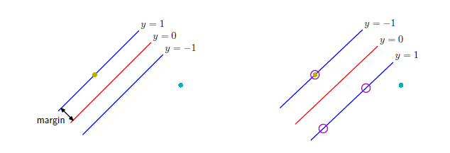
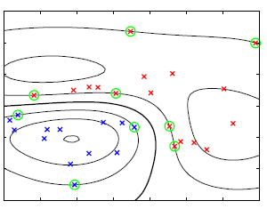
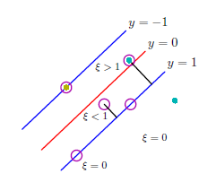
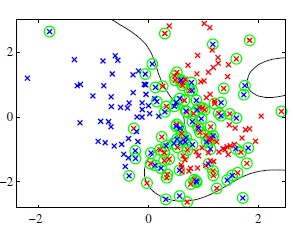

# Lecture Notes: PRML Chapter 7.1 – Maximum Margin Classifiers

## Prerequisites
- Linear classifiers and hyperplanes
- Convex optimization and quadratic programming
- Lagrangian duality and KKT conditions
- Kernel trick and feature space transformations

## Key Terminology
- **Support vector**: A data point with non-zero Lagrange multiplier; lies on or inside the margin and defines the boundary.
- **Margin**: The perpendicular distance from the separating hyperplane to the nearest data point.
- **Slack variable ($\xi_n$)**: Allows for violation of margin constraints in soft-margin SVMs.
- **Box constraint**: Bounds dual coefficients: $0 \le a_n \le C$.
- **Hinge loss**: Loss function defined as $[1 - y_nt_n]_+$; zero if prediction is sufficiently correct, linear otherwise.
- **Hard margin**: Assumes perfect separability; no slack variables.
- **Soft margin**: Allows margin violations via slack variables.
- **Kernel function**: Implicit inner product in high-dimensional feature space.

---

## Why It Matters

Support vector machines (SVMs) give an elegant solution to binary classification by finding the separating hyperplane that maximizes the margin between classes. This maximization improves generalization. The SVM solution is sparse—it depends only on the subset of points closest to the decision boundary (the support vectors), and its kernel formulation generalizes the idea to nonlinear boundaries without requiring explicit feature mappings.

---

## Problem Setup

We consider a two-class classification problem with training inputs $x_1, \dots, x_N$ and corresponding labels $t_n \in \{-1, +1\}$.

We define the linear discriminant function in feature space:
$$
y(x) = w^\top \phi(x) + b \tag{7.1}
$$

Our goal is to find $w, b$ such that the smallest margin (distance to decision boundary) is **maximized**:
$$
\text{maximize}_{w, b} \; \min_n \left( \frac{t_n(w^\top \phi(x_n) + b)}{\|w\|} \right) \tag{7.3}
$$

**Reformulation Insight**:  
This is equivalent to the following:

**Instead of maximizing margin**, we fix the minimal margin to **1** and **minimize** $\|w\|$:
$$
\min_{w, b} \frac{1}{2} \|w\|^2 \quad \text{subject to } t_n(w^\top \phi(x_n) + b) \ge 1 \tag{7.6}
$$

Why is this equivalent?

Because the objective is scale-invariant: scaling $(w, b)$ by $\kappa$ scales both numerator and denominator in the margin. So, we can fix the closest margin to 1 and minimize the norm instead—this yields the same optimal direction but sets a canonical scaling.

---

## 3-Column Proof: Hard-Margin SVM Dual Derivation

We now derive the dual form of the hard-margin SVM using Lagrange multipliers.

| Step | Formula | Reason |
|------|---------|--------|
| 1 | $$\min_{w, b} \frac{1}{2} \|w\|^2 \quad \text{subject to } t_n(w^\top \phi(x_n) + b) \ge 1$$ | Primal problem formulation |
| 2 | $$\mathcal{L}(w, b, a) = \frac{1}{2} \|w\|^2 - \sum_{n=1}^N a_n [t_n(w^\top \phi(x_n) + b) - 1]$$ | Construct Lagrangian with $a_n \ge 0$ |
| 3a | $$\frac{\partial \mathcal{L}}{\partial w} = \underbrace{\frac{\partial}{\partial w} \left( \frac{1}{2} \|w\|^2 \right)}_{= w} + \underbrace{\frac{\partial}{\partial w} \left( - \sum_n a_n t_n w^\top \phi(x_n) \right)}_{= - \sum_n a_n t_n \phi(x_n)} = 0$$ | Take derivative w.r.t. $w$ |
| 3 | $$\frac{\partial \mathcal{L}}{\partial w} = 0 \Rightarrow w = \sum_{n=1}^N a_n t_n \phi(x_n)$$ | Stationarity with respect to $w$ |
| 4a | $$\mathcal{L}(a) = \frac{1}{2} \left\| \sum_{n=1}^N a_n t_n \phi(x_n) \right\|^2 - \sum_{n=1}^N a_n [t_n(w^\top \phi(x_n) + b) - 1]$$ | Replace $w$ with the solution from Step 3 |
| 4b | $$\frac{1}{2} \left\| \sum_{n=1}^N a_n t_n \phi(x_n) \right\|^2 = \frac{1}{2} \sum_{n=1}^N \sum_{m=1}^N a_n a_m t_n t_m \phi(x_n)^\top \phi(x_m)$$ | Expand the norm term |
| 4c | $$\mathcal{L}(a) = \sum_{n=1}^N a_n - \frac{1}{2} \sum_{n=1}^N \sum_{m=1}^N a_n a_m t_n t_m \phi(x_n)^\top \phi(x_m)$$ | Combine terms and simplify |
| 5 | $$\tilde{\mathcal{L}}(a) = \sum_{n=1}^N a_n - \frac{1}{2} \sum_{n=1}^N \sum_{m=1}^N a_n a_m t_n t_m k(x_n, x_m)$$ | Replace $ \phi(x_n)^\top \phi(x_m)$ with $ k(x_n, x_m)$ |
| 6 | Maximize | |

---

## Hinge Loss and the C Parameter

In the non-separable case, we use **soft margins** and allow violations with a penalty.

This leads to the **hinge loss**:
$$
E_{\text{hinge}}(z) = [1 - z]_+ \tag{7.45}
$$

**Interpretation**:  
- If $t_n y_n \ge 1$: no loss  
- If $0 < t_n y_n < 1$: margin violation, linear loss  
- If $t_n y_n < 0$: misclassified, linear loss

The SVM objective with hinge loss becomes:
$$
\sum_{n=1}^N [1 - t_n y_n]_+ + \lambda \|w\|^2 \tag{7.44}
$$

Here, $\lambda = \frac{1}{2C}$ controls the trade-off:
- **Large $C$**: prioritize minimizing training error
- **Small $C**: prioritize maximizing margin (regularization)

---

## 3-Column Proof: Soft-Margin Dual with Slack Variables
We now derive the dual form of the hard-margin SVM using Lagrange multipliers:

- **Objective**: Reformulate the primal problem into its dual for efficient optimization.
- **Steps**:
  1. Start with the **primal problem**: minimize $\frac{1}{2} \|w\|^2$ subject to $t_n(w^\top \phi(x_n) + b) \ge 1$.
  2. Construct the **Lagrangian**: incorporate constraints using multipliers $a_n \ge 0$.
  3. Apply **stationarity conditions**:
     - $\frac{\partial \mathcal{L}}{\partial w} = 0 \Rightarrow w = \sum_{n=1}^N a_n t_n \phi(x_n)$
     - $\frac{\partial \mathcal{L}}{\partial b} = 0 \Rightarrow \sum_{n=1}^N a_n t_n = 0$
  4. Substitute into the Lagrangian to get the **dual problem**:
     $$\tilde{\mathcal{L}}(a) = \sum_n a_n - \frac{1}{2} \sum_{n,m} a_n a_m t_n t_m k(x_n, x_m)$$
  5. Maximize $\tilde{\mathcal{L}}(a)$ subject to:
     - $a_n \ge 0$
     - $\sum_n a_n t_n = 0$

- **Key Points**:
  - The dual problem is a **quadratic optimization problem** with linear constraints.
  - Solvable using tools like `qpsolvers` or `scipy.optimize`.

| Step | Formula | Reason |
|------|---------|--------|
| 1 | $$\min_{w,b,\xi} \frac{1}{2} \|w\|^2 + C \sum_n \xi_n \quad \text{s.t. } t_n(w^\top \phi(x_n) + b) \ge 1 - \xi_n, \; \xi_n \ge 0$$ | Soft-margin primal problem |
| 2 | $$\mathcal{L} = \frac{1}{2} \|w\|^2 + C \sum_n \xi_n - \sum_n a_n [t_n(w^\top \phi(x_n) + b) - 1 + \xi_n] - \sum_n \mu_n \xi_n$$ | Lagrangian with $a_n, \mu_n \ge 0$ |
| 3a | $$\frac{\partial \mathcal{L}}{\partial w} = \underbrace{\frac{\partial}{\partial w} \left( \frac{1}{2} \|w\|^2 \right)}_{= w} + \underbrace{\frac{\partial}{\partial w} \left( - \sum_n a_n t_n w^\top \phi(x_n) \right)}_{= - \sum_n a_n t_n \phi(x_n)} = 0$$ | Take derivative w.r.t. $w$ |
| 3b | $$w = \sum_n a_n t_n \phi(x_n)$$ | Solve for $w$ (stationarity condition) |
| 4 | $$\frac{\partial \mathcal{L}}{\partial b} = 0 \Rightarrow \sum_n a_n t_n = 0$$ | Stationarity |
| 5 | $$\frac{\partial \mathcal{L}}{\partial \xi_n} = 0 \Rightarrow a_n = C - \mu_n$$ | Complementarity |
| 6 | Substitute into dual: $$\tilde{\mathcal{L}}(a) = \sum_n a_n - \frac{1}{2} \sum_{n,m} a_n a_m t_n t_m k(x_n, x_m)$$ | Dual is same as hard-margin case |
| 7 | Subject to: $$0 \le a_n \le C, \quad \sum_n a_n t_n = 0$$ | Box constraints and balance condition |

---

## Prediction Function (Both Cases)

$$
y(x) = \sum_{n \in S} a_n t_n k(x, x_n) + b \tag{7.13}
$$

- $S$ = set of support vectors (points with $a_n > 0$)

---

## Bias Estimation from Support Vectors

For any support vector with $0 < a_n < C$:
$$
t_n \left( \sum_{m \in S} a_m t_m k(x_n, x_m) + b \right) = 1 \Rightarrow
b = \frac{1}{N_S} \sum_{n \in S} \left( t_n - \sum_m a_m t_m k(x_n, x_m) \right) \tag{7.18}
$$

---

## Relevant Figures from PRML

- **Figure 7.1**:  
     
    Illustrates the geometric margin and support vectors.
- **Figure 7.2**:   
     
   Shows a nonlinear decision boundary in 2D produced by a kernel SVM.
- **Figure 7.3**:   
     
   Clarifies role of slack variables and margin violations.
- **Figure 7.5**:  
     
   Compares hinge loss to logistic loss and squared error.
