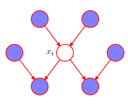
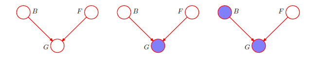
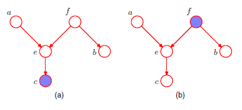
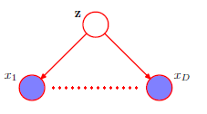

# Lecture Notes: PRML Chapter 8.2 – Conditional Independence

## Prerequisites

- Understanding of conditional, joint, and marginal probability
- Graph structure and Bayesian network factorization
- Concepts from Section 8.1 (Bayes nets, DAGs, CPDs)

## Key Terminology

- **Conditional independence**: $a \perp\!\!\!\perp b \mid c$ means $p(a \mid b, c) = p(a \mid c)$ for all values of $c$.
- **d-separation**: A graphical criterion for deciding if two variables are conditionally independent given a set of observed variables.
- **Tail-to-tail**: Structure $a \leftarrow c \rightarrow b$
- **Head-to-tail**: Structure $a \rightarrow c \rightarrow b$
- **Head-to-head**: Structure $a \rightarrow c \leftarrow b$
- **Explaining away**: When conditioning on a common effect induces dependence between its causes.
- **Markov blanket**: The minimal set of nodes that renders a node conditionally independent of all others.

## Why It Matters

Bayesian networks are only useful if we can exploit their structure. The d-separation criterion lets us determine conditional independence just by analyzing the graph. This reduces computation and guides model design.

## Key Ideas

### Conditional Independence Definition

Two variables $a$ and $b$ are conditionally independent given $c$ if:
$$
p(a \mid b, c) = p(a \mid c)
$$
or equivalently:
$$
p(a, b \mid c) = p(a \mid c)\, p(b \mid c)
$$
This must hold **for all values of $c$**.

### Three Canonical Structures

#### Tail-to-tail: $a \leftarrow c \rightarrow b$

- Unconditional: $a$ and $b$ are **dependent**
- Conditioning on $c$: $a \perp\!\!\!\perp b \mid c$ (path blocked)

#### Head-to-tail: $a \rightarrow c \rightarrow b$

- Unconditional: $a$ and $b$ are **dependent**
- Conditioning on $c$: $a \perp\!\!\!\perp b \mid c$ (path blocked)

#### Head-to-head (v-structure): $a \rightarrow c \leftarrow b$

- Unconditional: $a \perp\!\!\!\perp b$
- Conditioning on $c$: $a \not\!\perp\!\!\!\perp b \mid c$ (path unblocked)
- Bayes thm kind flips the edges....
- Also unblocked if any descendant of $c$ observed

This explains the phenomenon of **explaining away**.

### Explaining Away Example

Let $B$ = battery, $F$ = fuel tank, $G$ = gauge reading.

Graph:  
$B \rightarrow G \leftarrow F$

- $B$ and $F$ are marginally independent.
- If we observe $G$, knowledge of $B$ influences belief about $F$.
- If $G = 0$ and we learn $B = 0$, we update belief: $F$ likely not empty.

This is the **explaining away** effect.

### d-Separation

To determine whether $X \perp\!\!\!\perp Y \mid Z$, examine **all undirected paths** from $X$ to $Y$:

A path is **blocked** if it contains:

- A chain $a \rightarrow c \rightarrow b$ or fork $a \leftarrow c \rightarrow b$ where $c \in Z$
- A collider $a \rightarrow c \leftarrow b$ where neither $c$ **nor any descendant** of $c$ is in $Z$

If **all paths** are blocked, then $X \perp\!\!\!\perp Y \mid Z$.

### Markov Blanket

For a node $x_i$, the **Markov blanket** includes:

- Parents of $x_i$
- Children of $x_i$
- Co-parents (other parents of $x_i$'s children)

Knowing these nodes makes $x_i$ conditionally independent of all other nodes.

## Relevant Figures from PRML

- **Figure 8.15–8.20**: Illustrate the three canonical connection types and their blocking behavior.
- **Figure 8.21**:
    
  Gauge/Battery/Fuel example of explaining away.
- **Figure 8.22**:
    
  Shows d-separation in various 3-node paths.
- **Figure 8.23**: Inference from Gaussian data using Bayesian structure.
- **Figure 8.24**:
    
  Naive Bayes model—features conditionally independent given class label $\mathbf{z}$.
- **Figure 8.26**:
     
   Depicts the Markov blanket of a node.
