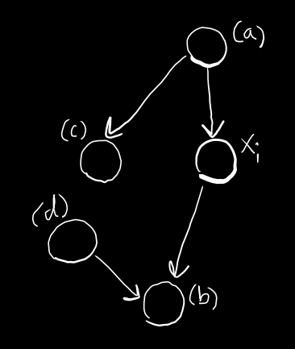

Quiz title: PRML Chapter 8.2 – Conditional Independence  
Quiz description: This quiz tests understanding of d-separation, conditional independence patterns, and Markov blankets in Bayesian networks.  
  The questions focus on structures and implications covered in Section 8.2 of PRML.  
shuffle answers: true  
show correct answers: false

Title: concept-check – remember – non-edge – conditional independence definition  
Points: 1  
1. What does it mean for variables $a$ and $b$ to be conditionally independent given $c$?  
a) $p(a, b \mid c) = p(a \mid b, c)$  
... Incorrect. This expression omits the full independence relationship.  
*b) $p(a \mid b, c) = p(a \mid c)$  
... Correct. This is the definition of conditional independence.  
c) $p(a \mid b, c) = p(b \mid a, c)$  
... Incorrect. This suggests symmetry of conditional distributions, which is not implied.  
d) $p(a, b) = p(a) p(b \mid c)$  
... Incorrect. This mixes marginal and conditional distributions inconsistently.  

Title: medium – understand – edge – head-to-head unblocking  
Points: 1  
2. In a head-to-head structure $a \rightarrow c \leftarrow b$, what happens if we observe $c$?  
a) $a$ and $b$ become independent  
... Incorrect. Observing $c$ introduces dependence between $a$ and $b$.  
*b) $a$ and $b$ become dependent (path is unblocked)  
... Correct. Conditioning on a collider or its descendant activates the path.  
c) $a$ and $c$ become marginally independent  
... Incorrect. The structure implies dependency, not independence.  
d) $a$ and $b$ are deterministically linked  
... Incorrect. The relationship remains probabilistic.  

Title: concept-check – remember – non-edge – d-separation blocking rule  
Points: 1  
3. Which path structure is **not blocked** by conditioning on the middle node?  
a) $a \rightarrow c \rightarrow b$  
... Incorrect. Conditioning on $c$ blocks this head-to-tail path.  
*b) $a \rightarrow c \leftarrow b$  
... Correct. This is a head-to-head (collider); conditioning unblocks it.  
c) $a \leftarrow c \leftarrow b$  
... Incorrect. Conditioning on $c$ blocks this tail-to-tail structure.  
d) $a \leftarrow c \rightarrow b$  
... Incorrect. Conditioning on $c$ blocks this fork structure.  

Title: medium – apply – non-edge – Markov blanket membership  
Points: 1  
4. Which of the following is NOT part of the Markov blanket for a node $x_i$?  
   
a) A parent of $x_i$  
... Incorrect. Parents are always in the Markov blanket.  
b) A child of $x_i$  
... Incorrect. Children are included.  
*c) A node that shares a parent with $x_i$ but is not a child of $x_i$  
... Correct. Co-parents of $x_i$’s children are included, but not arbitrary nodes.  
d) A co-parent of $x_i$’s child  
... Incorrect. Co-parents of children are part of the Markov blanket.  

Title: medium – understand – edge – explaining away intuition  
Points: 1  
5. In the gauge example ($B \rightarrow G \leftarrow F$), what effect does observing $G$ have?  
a) It makes $B$ and $F$ independent  
... Incorrect. Observing $G$ creates dependence.  
*b) It induces dependence between $B$ and $F$  
... Correct. This is the explaining away effect.  
c) It forces $G$ to be deterministic  
... Incorrect. $G$ remains probabilistic with conditional uncertainty.  
d) It removes all information about $B$  
... Incorrect. Observation of $G$ updates beliefs about $B$.  

Title: medium – apply – edge – collider structure inference  
Points: 1  
6. If a path contains $a \rightarrow c \leftarrow b$, and neither $c$ nor any of its descendants are in the conditioning set, what is true?  
a) The path is active  
... Incorrect. A collider blocks the path unless conditioned on.  
*b) The path is blocked  
... Correct. The collider blocks unless conditioned on itself or its descendants.  
c) $a$ and $b$ are conditionally independent given $c$  
... Incorrect. The conditioning set excludes $c$, so the path is still blocked.  
d) $a$ and $b$ are deterministically related  
... Incorrect. No deterministic relationship exists.  

Title: medium – understand – edge – d-separation over multiple paths  
Points: 1  
7. To confirm that $X \perp\!\!\!\perp Y \mid Z$ via d-separation, what must be true?  
a) At least one path from $X$ to $Y$ must be blocked  
... Incorrect. All paths must be blocked.  
*b) Every path from $X$ to $Y$ must be blocked given $Z$  
... Correct. d-separation requires blocking all undirected paths.  
c) $X$ must be a root node in the graph  
... Incorrect. Root status is irrelevant to d-separation.  
d) There must be a head-to-tail path between $X$ and $Y$  
... Incorrect. That’s a possible structure, not a requirement.  

Title: hard – analyze – edge – effect of conditioning on a collider’s descendant  
Points: 1  
8. What happens when we condition on a **descendant** of a head-to-head node (collider)?  
a) The path remains blocked  
... Incorrect. Conditioning on a descendant unblocks the collider.  
*b) The path becomes active (unblocked)  
... Correct. Conditioning on any descendant of a collider opens the path.  
c) The child of the collider becomes a new parent node  
... Incorrect. Structure does not change; only dependencies are affected.  
d) All other colliders in the graph are activated  
... Incorrect. Other colliders are unaffected unless also conditioned on.  

Title: medium – apply – non-edge – naive Bayes conditional independence  
Points: 1  
9. In a naive Bayes model, all features $x_1, \dots, x_D$ are conditionally independent given class $C$. What does this imply?  
a) $x_i \perp\!\!\!\perp x_j$  
... Incorrect. They are not unconditionally independent.  
*b) $x_i \perp\!\!\!\perp x_j \mid C$  
... Correct. This is the defining assumption of naive Bayes.  
c) $C$ must be a deterministic function of the $x_i$  
... Incorrect. $C$ is modeled probabilistically.  
d) Each $x_i$ must be marginally independent of $C$  
... Incorrect. Each $x_i$ depends on $C$ by design.  

Title: hard – analyze – edge – semantics of DF set  
Points: 1  
10. What does the set $DF$ represent in the context of a directed graphical model?  
a) All joint distributions that satisfy marginal independence for every variable  
... Incorrect. $DF$ is about conditional independence, not marginal independence.  
*b) All distributions that satisfy the conditional independence properties implied by the graph structure  
... Correct. $DF$ includes exactly those distributions consistent with the graph’s d-separation relations.  
c) All distributions that factorize into fully connected cliques  
... Incorrect. That describes undirected models, not DAGs.  
d) Only those distributions that match the graph structure exactly and no more  
... Incorrect. $DF$ includes distributions with additional independencies as long as the graph’s are preserved.  
