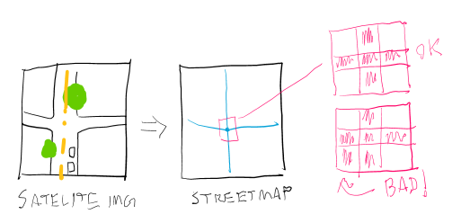
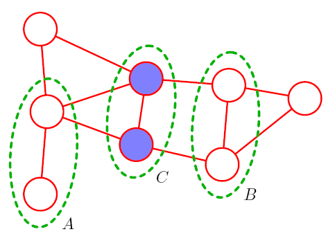
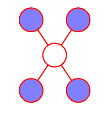
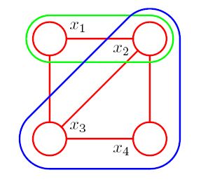
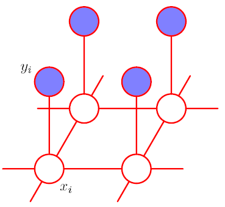
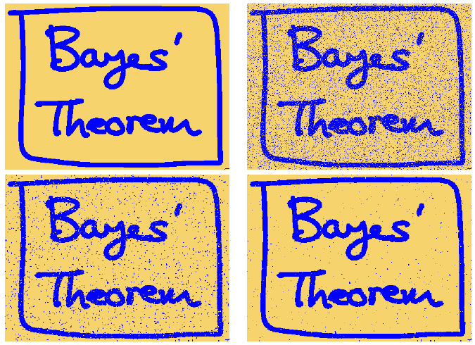
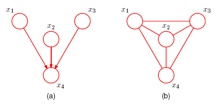

# Lecture Notes: PRML Chapter 8.3 – Markov Random Fields

## Prerequisites

- Conditional independence and graphical d-separation
- Joint and marginal distributions
- Directed graphical models and factorized representations

## Key Terminology

- **Markov Random Field (MRF)**: An undirected graphical model over a set of variables where edges indicate potential statistical dependencies.
- **Clique**: A fully connected subset of nodes in the graph.
- **Maximal clique**: A clique that is not a subset of any larger clique.
- **Potential function** $\psi_C(x_C)$: A non-negative function over variables in a clique; not necessarily a probability.
- **Partition function** $Z$: A normalization constant to ensure that the joint distribution sums (or integrates) to 1.
- **Energy function** $E(x)$: The negative logarithm of a potential function, used in exponential family representations.
- **Graph separation**: A simple graphical test for conditional independence in undirected graphs.
- **Markov blanket (MRF)**: The neighbors of a node; sufficient for conditional independence.
- **Moral graph**: An undirected graph derived from a directed one by marrying parents and dropping directions.

## Why It Matters

MRFs allow modeling of complex joint distributions without requiring directionality. They are particularly suited to domains like image modeling, spatial statistics, and physics, where interactions are often symmetric and best expressed as undirected dependencies. Compared to directed models, understanding conditional independencies is simpler, based on graph separation alone. Because potentials need not be normalized probabilities, MRFs can conveniently encode ad hoc preferences or compatibility scores. Moreover, many graph-based algorithms (e.g., graph cuts, message passing) exist for efficient inference.

> ### Sidebar: Conditional Random Fields (CRFs) vs. Markov Random Fields (MRFs)
>
> When you do research in ML, you'll often encounter references to **CRFs**. A **Conditional Random Field** is an undirected graphical model that defines a distribution **over output variables $y$ given input variables $x$** — that is, it directly models $p(y \mid x)$.
>
> While CRFs resemble Markov Random Fields (MRFs) with some nodes observed, they differ in intent and structure:
>
> - **MRFs** define a full joint distribution: $p(x, y) = \frac{1}{Z} \prod_C \psi_C(x_C, y_C)$  
>   Conditioning on $x$ simply fixes those values.
>
> - **CRFs** define a conditional distribution directly: $p(y \mid x) = \frac{1}{Z(x)} \prod_C \psi_C(y_C, x_C)$  
>   There is no model for $p(x)$, and the normalization $Z(x)$ depends on the observed input.
>
> MRFs are **generative**  
> CRFs are **discriminative**
>
> CRFs avoid the need to model $p(x)$, which simplifies learning. They’re common in structured prediction tasks like labeling sequences or segmenting images.
>
> **Example:** In a project that predicts street maps from satellite images, a CRF might model preferences over valid street map configurations (e.g., favoring 3×3 lines of connected pixels, disallowing 2×2 foreground blocks), without needing to model the probability of the satellite image itself.
> 

## Key Ideas

### Undirected Graphs and Conditional Independence

In contrast to Bayes nets, MRFs use **undirected edges**, and conditional independence is defined via **graph separation**:

- For sets $A$, $B$, and $C$, the conditional independence $A \perp\!\!\!\perp B \mid C$ holds if **all paths** between $A$ and $B$ pass through $C$.

> Simpler than d-separation: No colliders or "explaining away."

Alternative test: Remove nodes in $C$ and all their edges; if $A$ and $B$ are disconnected, then they are conditionally independent.

---

### Markov Blanket (Undirected Case)

In an MRF, the **Markov blanket** of a node is just its **neighbors**. This suffices to isolate the node from all others:

- $x_i \perp\!\!\!\perp \text{rest} \mid \text{neighbors}(x_i)$

No co-parents or descendants are needed.

---

### Factorization in MRFs

The joint distribution factors as a product of **potential functions** over **maximal cliques**:

$$
p(x) = \frac{1}{Z} \prod_C \psi_C(x_C)
$$

Where:

- $\psi_C(x_C) \ge 0$ is a potential over clique $C$
- $Z = \sum_x \prod_C \psi_C(x_C)$ ensures proper normalization

Here are some examples of cliques.

> NOTE: Individual nodes are also 1-Cliques, edges are 2-Cliques.

Unlike Bayes nets, the potential functions $\psi_C$ need not have probabilistic interpretation. They simply indicate a **preference** for certain configurations of variables.

> Directed: factors are conditional distributions  
> Undirected: factors are **unnormalized potentials**

---

### Energy-Based View

It’s often convenient to define potentials as exponentials:

$$
\psi_C(x_C) = \exp\left(-E_C(x_C)\right)
$$

This gives the **Boltzmann distribution** (if you’re a physicist) or the **Gibbs distribution** (if you’re a statistician) — they mean the ***same thing***:

$$
p(x) = \frac{1}{Z} \exp\left(-\sum_C E_C(x_C)\right)
$$

High-probability states have **low total energy**.

> Basically, we define an *energy*, which is proportional to the negative log of the probability.

---

### Hammersley-Clifford Theorem

For **strictly positive** distributions:

- The set of distributions that **factorize over cliques** equals the set that satisfy the **conditional independencies implied by the separation rule in the graph**.

The separation rule is sometimes called the **global Markov property**. Whereas, the **local Markov property***** is that a node is conditionally independent given its neighbors.

This equivalence connects factorization and graph-separation semantics.

> **Strict positivity** means $p(x) > 0$ for all configurations of $x$; it rules out “hard constraints” that force some outcomes to have zero probability.  

---

### Example: Image Denoising (Ising Model)

- The Ising model can be interpreted as a **CRF** defined over **2-cliques** (pairwise terms).
  - Unary terms can be absorbed into 2-clique potentials.
  - Even if higher-order cliques exist, it's common to express their energy as the sum of pairwise energies — and it works out in practice.
- Variables: true pixel labels $x_i \in \{-1, +1\}$ and noisy observations $y_i$
- Two types of interactions:
  - $\{x_i, y_i\}$: correlates latent variable with observation  
    $$E(x_i, y_i) = -\eta x_i y_i$$
  - $\{x_i, x_j\}$: encourages neighboring pixels to agree  
    $$E(x_i, x_j) = -\beta x_i x_j$$

- Full energy:
  $$
  E(x, y) = \underbrace{\sum_i h x_i}_{\text{unary}}
         - \underbrace{\beta \sum_{\{i,j\}} x_i x_j
         + \eta \sum_i x_i y_i}_{\text{pairwise}}
  $$

- Inference: fix $y$, then maximize $p(x \mid y)$ using **ICM**, **graph cuts**, or message passing.  

### Inference with ICM

One simple approach for MAP inference in models like the Ising model is **Iterated Conditional Modes (ICM)**:

- ICM starts with an initial guess for the hidden variables (e.g., all $x_i = 1$).
- Then, for each variable $x_i$, it **greedily updates** its value to:
  $$
  x_i \leftarrow \arg\max_{x_i} \; p(x_i \mid x_{\setminus i}, y)
  $$
- This process iterates over all variables repeatedly until the configuration **converges to a local maximum** of the posterior or **a local minimum of the total energy**

> **Update Schedule**:  
> Variables are typically updated **sequentially** in a fixed or cyclic order.  
> While this makes implementation simple and fast, it can also bias convergence.  
> More advanced variants may use random permutations, residual-based prioritization,  
> or even asynchronous parallel updates to improve robustness.

ICM is fast and easy to implement, but it may get stuck in poor local optima. It works best when the energy surface is smooth or near-convex.

> **Graph Cuts**:  
> In many cases (e.g. binary variables),    **graph cuts** can find the exact **globally optimal** MAP configuration.  These methods are more accurate and less prone to local minima than ICM,   but they require specific structure and are **not covered in this course**.
---

### Relation to Directed Graphs

To convert a Bayes net to an MRF:

1. **Moralize** the graph:

   > Yes, really —  parents have to get married. It's outdated terminology, but it's what we’ve got.  
   - Add edges between parents of every node
   - Drop all edge directions
2. Represent each conditional distribution as a clique potential

> Moralization may create fully connected cliques—potentially **destroying** the original independencies.

---

### Maps of Distributions

- **I-map (Independency map)**: A graph is an I-map for a distribution if **every conditional independence implied by the graph holds in the distribution**.  

  > Think: **no extra edges** — minimal structure that still correctly encodes all the distribution’s independencies.

- **D-map (Dependency map)**: A graph is a D-map if **every dependency in the distribution appears as a connection in the graph**.  

  > Think: **all relevant edges present** — the graph doesn’t miss anything the distribution actually depends on.

- **Perfect map**: A graph that is both an I-map and a D-map — all and only the true independencies are encoded by the graph.

Some distributions have a perfect map in one formalism (e.g., directed graphs), but **not in the other**.  
For example:

- In a **Bayesian network (BN)**, it’s possible to construct **I-maps** by dropping non-essential edges to express the minimal set of independencies.
- In an **MRF**, it's harder to do this cleanly — moralization and undirected factorization often result in **extra edges**, which means you get a D-map but **not** an I-map.

---

## Relevant Figures from PRML

- **Fig 8.27**: Graph separation for conditional independence
- **Fig 8.28**: Markov blanket in an undirected graph
- **Fig 8.29**: Cliques and maximal cliques
- **Fig 8.30–31**: Image denoising setup and graphical model
- **Fig 8.32–33**: Moralization from directed to undirected graphs
- **Fig 8.34–36**: Examples where directed and undirected models differ in expressivity
