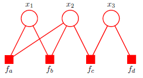
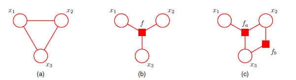

## Prerequisites

- Directed and undirected graphical models
- Marginalization and conditional independence
- Chain and tree-structured graphs
- Factorization of joint distributions
- Message passing concepts (e.g., belief propagation)

## Key Terminology

- **Tree (graph)**: A graph with exactly one path between any two nodes and no loops.
- **Polytree**: A directed graph where the underlying undirected version is a tree.
- **Factor graph**: A bipartite graph that explicitly represents the factorization of a probability distribution using variable and factor nodes.
- **Sum-product algorithm**: A message-passing algorithm for computing marginal distributions efficiently in tree-structured factor graphs.
- **Max-sum algorithm**: A variant of sum-product using maximization instead of summation to find the most probable configuration.
- **Loopy belief propagation**: An approximate inference algorithm that applies the sum-product algorithm in graphs with cycles.
- **Backtracking**: In max-sum, the process of recovering the globally consistent maximizer by tracing stored maximizing configurations backward.

## Why It Matters

Efficient inference is crucial for learning, decision-making, and prediction in probabilistic models. Intractable exact inference can render models useless in practice. Tree-structured graphs allow exact inference via local message passing, which generalizes to powerful algorithms (sum-product, max-sum). Even for loopy graphs, these principles inspire practical approximations like loopy belief propagation.

## Key Ideas

### 8.4.2 Trees

**Why it matters:** Trees are the simplest non-trivial graphs where inference is tractable. They are foundational for understanding how message passing works.

**Key Points:**

- Undirected tree: one path between any two nodes, no loops.
- Directed tree: has a single root with all nodes having at most one parent.
- Polytrees generalize this by allowing multiple parents as long as the undirected version remains a tree.
- Conversion between directed/undirected trees and their moralized/factor graph versions is straightforward.

### 8.4.3 Factor Graphs

**Why it matters:** Factor graphs unify directed and undirected models, enabling a consistent message-passing framework.

**Key Points:**

- Represents joint distribution as $p(\mathbf{x}) = \frac{1}{Z}\prod_s f_s(\mathbf{x}_s)$
- Contains variable nodes and factor nodes; edges connect a factor to all variables it depends on.
- Bipartite structure ensures clear flow of messages.
- Enables more detailed control over factorization (unlike undirected cliques).

### 8.4.4 The Sum-Product Algorithm

**Why it matters:** It allows exact, efficient computation of marginals in tree-structured models using local message passing.

**Goal:** Compute the marginal $p(x_i)$ for each variable node $x_i$.

---

**Core Equation (unnormalized marginal):**
$$
p(x_i) \propto \prod_{f_s \in \text{ne}(x_i)} \mu_{f_s \rightarrow x_i}(x_i)
$$

---

**Message Types:**

1. **From factor node to variable node:**
   $$
   \mu_{f_s \rightarrow x}(x) = \sum_{\mathbf{x}_s \setminus x} f_s(\mathbf{x}_s) \prod_{x_m \in \text{ne}(f_s) \setminus x} \mu_{x_m \rightarrow f_s}(x_m)
   $$
   This is a **sum of products**: we marginalize out other variables in the factor's scope.

2. **From variable node to factor node:**
   $$
   \mu_{x \rightarrow f_s}(x) = \prod_{f_l \in \text{ne}(x) \setminus f_s} \mu_{f_l \rightarrow x}(x)
   $$
   Each variable sends a product of incoming messages (excluding the one it’s sending to).

---

**Base Cases (Leaf Initialization):**

- **Leaf variable node:** sends
  $$
  \mu_{x \rightarrow f}(x) = 1
  $$
  (represents uniform prior or no evidence)

- **Leaf factor node:** sends
  $$
  \mu_{f \rightarrow x}(x) = f(x)
  $$
  (just returns its factor function)

---

**Two-Phase Protocol for Full Inference:**

1. **Upward pass (leaf → root):**
   - Start from leaves.
   - Each node sends a message to its parent once it has received all other incoming messages.

2. **Downward pass (root → leaves):**
   - After root gets all messages, it sends messages back out to neighbors.
   - This ensures every node has received all its incoming messages.

---

**Final Step (Marginals):**

After both passes, compute:
$$
p(x_i) \propto \prod_{f_s \in \text{ne}(x_i)} \mu_{f_s \rightarrow x_i}(x_i)
$$

Normalize $p(x_i)$ if needed.

---

**Efficiency:**

- Total messages: 2 per edge (one in each direction)
- Total complexity: $O(|E|)$ (linear in number of edges)

### 8.4.5 The Max-Sum Algorithm

**Why it matters:**  
The max-sum algorithm finds the most probable configuration (MAP estimate) of a set of variables in a graphical model. It’s particularly useful when we want a single most likely assignment rather than full marginal distributions.

---

**Objective:**
We want to compute:
$$
\mathbf{x}^{\text{max}} = \arg\max_{\mathbf{x}} p(\mathbf{x})
$$

---

**Approach Overview:**

- Express the joint distribution $p(\mathbf{x})$ in a **factor graph** form.
- Replace **products** with **sums of logs**.
- Replace **summations** with **maximizations**.
- This converts the sum-product algorithm into the **max-sum** algorithm:
  a dynamic programming technique for global MAP inference on trees.

---

**Message Equations:**

Let $\mu_{f \rightarrow x}(x)$ denote a message from factor node $f$ to variable node $x$, and $\mu_{x \rightarrow f}(x)$ the reverse.

1. **Factor → Variable:**
   $$
   \mu_{f \rightarrow x}(x) = \max_{\mathbf{x}_s \setminus x} \left[ \ln f(\mathbf{x}_s) + \sum_{x_m \in \text{ne}(f) \setminus x} \mu_{x_m \rightarrow f}(x_m) \right]
   $$
   This aggregates information about the best-scoring local configurations.

2. **Variable → Factor:**
   $$
   \mu_{x \rightarrow f}(x) = \sum_{f_l \in \text{ne}(x) \setminus f} \mu_{f_l \rightarrow x}(x)
   $$
   This propagates the sum of log-scores coming into $x$.

---

**Message Initialization:**

- Leaf **variable** node: sends $\mu_{x \rightarrow f}(x) = 0$
(log of one!)
- Leaf **factor** node: sends $\mu_{f \rightarrow x}(x) = \ln f(x)$

---

**Two-Phase Procedure:**

1. **Forward Pass (Upward, Leaves → Root):**
   - Arbitrarily choose a **root node**.
   - Begin from **leaf nodes** and propagate messages **toward the root**.
   - During each maximization in the forward pass, store the **argmax** (i.e., the value of $x$ that attained the max) as $\phi$
   - At the root, compute:
     $$
     \ln p_{\text{max}} = \max_{x} \sum_{f \in \text{ne}(x)} \mu_{f \rightarrow x}(x)
     $$
   - Also record the **maximizing value** $x^{\text{max}}$ for the root variable.

2. **Backward Pass (Backtracking, Root → Leaves):**

   - After identifying $x^{\text{max}}_{\text{root}}$, **trace back** using stored values:
     $$
     x_j^{\text{max}} = \phi_j(x_k^{\text{max}})
     $$
     where $x_k$ is the parent/neighbor of $x_j$ in the tree and $\phi_j(x_k)$ is the saved max value from the upward pass.
   - This ensures a **globally consistent MAP assignment**.

---

**Key Insight:**

- Unlike sum-product, which computes **distributions**, max-sum computes **only one optimal configuration**.
- You must **record** the maximizing assignments ($\phi$ maps) to reconstruct the correct global solution.
- Local maximization at each variable **is not sufficient**.

---

> **🔎 Sidebar: Max-Sum vs. Sum-Product — Message Passing Comparison**
>
> |                      | **Sum-Product** (Marginals)                      | **Max-Sum** (MAP Configuration)            |
> |----------------------|--------------------------------------------------|--------------------------------------------|
> | **Goal**             | Compute all $p(x_i)$                             | Compute $\arg\max_{\mathbf{x}} p(\mathbf{x})$ |
> | **Message directions** | Messages pass **in both directions** on every edge | Only **forward pass** is needed (plus backtracking) |
> | **Passes required**  | Two full passes (leaf → root, then root → leaf)  | One pass (leaf → root) plus backtracking   |
> | **Final output**     | Normalized or unnormalized marginals             | One globally consistent max configuration  |
> | **Uses**             | Posterior beliefs, expectations, EM              | MAP decoding, structured prediction        |
>
> **Bottom line:**  
> Sum-product is exhaustive (compute all marginals).  
> Max-sum is focused (recover one most likely configuration).

---

### 8.4.6 Exact Inference in General Graphs

Skipped.

### 8.4.7 Loopy Belief Propagation

**Why it matters:** A simple, practical approximation in non-tree graphs.

**Key Ideas:**

- Apply sum-product rules naively to graphs with loops.
- Messages are repeatedly passed until convergence.
- No guarantee of convergence or correctness.
- Works well in practice (e.g., error-correcting codes).

### 8.4.8 Learning the Graph Structure

Skipped.

## Relevant Figures from PRML

- **Figure 8.39**: Tree vs. polytree comparison.
- **Figure 8.40–8.42**: Directed, undirected, and factor graph conversions.
- **Figure 8.46–8.50**: Message passing diagrams for sum-product algorithm.
- **Figure 8.52–8.53**: Illustrations of forward/backward message flow and backtracking in max-sum.
- **Figure 8.43–8.45**: How polytrees and complex factor graphs maintain tractable structure.
- **Table 8.1**: Shows why maximizing marginals differs from maximizing the joint.
