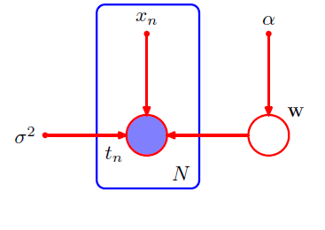

# Lecture Notes: PRML Chapter 8 – Graphical Models

## Prerequisites

* Basics of probability distributions (joint, marginal, conditional)
* Concept of conditional independence
* Familiarity with directed acyclic graphs (DAGs)
* Undirected graphs and factorization of joint distributions

## Key Terminology

* **Graphical model**: A probabilistic model represented by a graph (directed or undirected).
* **Bayesian network**: A directed acyclic graphical model encoding conditional dependencies.
* **Generative model**: A model that defines a stochastic process for generating data from latent causes.
* **Ancestral sampling**: Sampling from a directed graphical model by sampling each node conditioned on its parents, in topological order.
* **Parent nodes**: The set of nodes with arrows going into a given node.
* **Plate notation**: A way to represent repeated independent structures in a compact graphical form.
* **Deterministic node**: A node that is a deterministic function of its parents, typically shown with a small dot.
* **Observed variable**: A variable for which data is available, typically shown with a shaded node.

## Why It Matters

Directed graphical models allow us to represent complex joint distributions in a modular way by exploiting conditional independencies. This factorization not only makes computation tractable but also supports interpretable, generative explanations of data. They are foundational to many models in machine learning, including hidden Markov models, latent variable models, and variational inference.

## Examples of Problems Suited to Graphical Models

* **Causal discovery in biology**: Modeling gene regulatory networks with Bayesian networks to infer causal relationships.
* **Image denoising & segmentation**: Using MRFs to capture the spatial dependencies among neighboring pixels.
* **Natural language parsing**: Representing syntactic dependencies in sentences as directed models.
* **Error‑correcting codes**: LDPC and turbo codes as factor graphs for efficient belief propagation decoding.
* **Social network analysis**: Inferring community structures and influence using undirected models.
* **Sensor networks**: Aggregating noisy measurements via distributed message passing in factor graphs.

## Key Ideas

### 8.1 Directed Graphical Models (Bayesian Networks)

**Why it matters:** Bayesian networks express rich dependency structures with clear semantics for causality and inference. They are also **generative models**, meaning they define a process for producing synthetic samples consistent with the structure.

**Joint Distribution Factorization:**

$$
p(x_1, x_2, \ldots, x_K) = \prod_{k=1}^K p(x_k \mid \text{pa}(x_k)) \tag{8.5}
$$

This is the defining factorization of a Bayesian network, and it’s enabled by the assumption that each variable only depends on its **parents** in the DAG.

Example:
  
$$p(a, b, c)= p(a)p(b|a)p(c|ab)\tag{8.2}$$

Each node in the graph corresponds to a **conditional probability distribution (CPD)**.

---

### Graph Notation

Before performing any sampling or inference, the structure of the graph itself must be understood.

* Each node represents a random variable.
* Directed edges indicate conditional dependence: if there is an arrow from $x_i$ to $x_j$, then $x_j$ depends on $x_i$.
* The absence of an edge conveys conditional independence, depending on the context.
* **No cycles are allowed**—the graph must be acyclic for factorization and ancestral sampling to be valid.
* Bayes Nets are **Directed Acyclic Graphs** (DAGs).

---

### Plates, Deterministic, and Observabed Variables

* **Plates** indicate repeated structure (e.g., $n = 1, \dots, N$)
* **Deterministic variables** are shown with **small filled dots**
* **Observed variables** are shown as **shaded nodes**

These conventions are illustrated below:

The figure shows a **linear regression model**:
$$
p(\mathbf{t}, \mathbf{w} \mid \mathbf{x}, \alpha, \sigma^2)
= p(\mathbf{w} \mid \alpha) \prod_{n=1}^N p(t_n \mid \mathbf{w}, \mathbf{x}_n, \sigma^2)
$$

* $\alpha$, $\sigma^2$ and $\mathbf{x}_1\dots \mathbf{x}_N$ are deterministic parameters. That is, not associated with a probability distribution.
* The $\mathbf{x}_n$, and $t_n$ are inside the plate (for $n = 1 \dots N$)
* The $t_n$ are **observed** given $\mathbf{x}_n$, $\mathbf{w}$. Note that this is different than a deterministic variable - it still has a conditional probability distribution and Bayes theorem can be used to infer information about $\mathbf{w}$.

In this case, the joint over $\mathbf{t}, \mathbf{w}$ factorizes as:

$$
p(\mathbf{t}, \mathbf{w}) = p(\mathbf{w}) \prod_{n=1}^N p(t_n \mid \mathbf{w})
$$

$$
p(x_1)\, p(x_2)\, p(x_3)\, p(x_4 \mid x_1, x_2, x_3)\, p(x_5 \mid x_1, x_3)\, p(x_6 \mid x_2)\, p(x_7 \mid x_4, x_5)
$$

> The key value of a Bayesian network lies in identifying **conditional independencies**. A fully connected graph provides **no savings** over the full joint, but a sparse graph reduces both representation cost and learning complexity.

* If a discrete variable has no parents and takes on $K$ possible values, then the CPD requires $K - 1$ parameters (since they must sum to 1).
* If it has a single discrete parent also with $K$ values, then the CPD requires $K\times(K - 1)$ parameters — $K - 1$ for each parent configuration.

$$p(x_1,]x_2, \dots, x_n) = p(x)\prod_{i=2}^M p(x_i|x_{i-1})$$

In this case:

* The naive joint distribution would take $K^M-1$ parameters.
* As factored, $K-1$ for $x_1$ and $(M-1)\times K \times (K-1)$ for $x_2\dots x_M$

---

### Generative Semantics and Ancestral Sampling

Directed graphical models describe a **stochastic generative process**. Sampling proceeds as follows:

1. **Topologically sort** the nodes in the DAG.
2. For each variable $x_i$, **sample** from $p(x_i \mid \text{pa}(x_i))$.

This is called **ancestral sampling**. It’s called that because each node is sampled after its ancestors in the graph.

**Reminder:** How to perform a topological sort using DFS:

1. Initialize all nodes as unvisited.
2. For each unvisited node, call DFS recursively on all children.
3. After all descendants are processed, add the current node to a list.
4. Reverse the list to get a valid topological ordering.

This ensures parents are always processed before children during sampling.

> This process defines a valid **joint distribution**. You can simulate full data vectors just by sampling each node in order.

Reminder of how to sample Bernoulli:

* Callthe python function, or...
* Generate a uniform random number $p$ in the range 0-1
* Subtract each probability $\mu_i$ from $p$ until you the sum becomes negative; $i$ is then your random sample.  

---

### Parameter  Sharing

Graphical models allow **parameter sharing**.

For instance, several nodes can share a single conditional distribution (e.g., same $\mu$):

This means:

* Fewer parameters
* More data-efficient learning
* Imposed structural priors (like repeated roles or modules)

---

## Summary

* Directed graphical models factorize joint distributions using conditional dependencies.
* They define **generative models**, where data can be sampled using ancestral sampling.
* Graphs encode **independence assumptions**, enabling compact and efficient models.
* **Plates**, **shading**, and **deterministic dots** are critical conventions.
* Models can reduce complexity via **parameter sharing** and **sparse structure**.
* Valid ancestral sampling requires topological sort; this can be computed via DFS.
