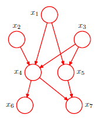

Quiz title: PRML Chapter 8 – Directed Graphical Models  
Quiz description: This quiz tests understanding of key ideas from Section 8.1 of PRML, including Bayesian network structure, generative semantics, and parameterization.  
shuffle answers: true  
show correct answers: false

Title: concept-check – understand – non-edge – CPD parameter count  
Points: 1  
1. A discrete variable has $K$ possible values and no parent nodes. How many independent parameters are required to specify its conditional probability distribution (CPD)?  
a) $K$  
... Incorrect. This would overparameterize the distribution; the probabilities must sum to one.  
*b) $K - 1$  
... Correct. One degree of freedom is lost due to the normalization constraint.  
c) $K^2$  
... Incorrect. This applies only in the case of dependencies on other discrete variables.  
d) $2K$  
... Incorrect. There's no multiplication of degrees of freedom in the no-parent case.  

Title: medium – apply – edge – effect of adding parent  
Points: 1  
2. Suppose a discrete variable $X$ with $K$ values originally has no parents. If we add a single discrete parent $Y$, also with $K$ values, how many parameters are now required to specify the CPD for $X$ given $Y$?
a) $K - 1$  
... Incorrect. That’s the number of parameters when $X$ has no parents.  
b) $K$  
... Incorrect. This still ignores the need for separate distributions per parent configuration.  
*c) $K(K - 1)$  
... Correct. Each of the $K$ values of $Y$ requires a CPD for $X$ with $K - 1$ degrees of freedom.  
d) $K^2$  
... Incorrect. $K^2$ counts all entries in the table but overcounts the independent parameters.

Title: medium – understand – non-edge – deterministic vs observed  
Points: 1  
4. What distinguishes a deterministic variable from an observed variable in a Bayesian network?  
a) A deterministic variable is fixed by data; an observed variable is not  
... Incorrect. Both may have known values, but that’s not the defining difference.  
*b) A deterministic variable is not a random variable; an observed variable is a random variable that has been assigned a value  
... Correct. Deterministic variables have no probability distribution; observed variables do, but their value is known.  
c) Observed variables are functions of their parents; deterministic variables are sampled  
... Incorrect. This reverses the roles.  
d) A deterministic variable must be shaded; an observed variable must be dotted  
... Incorrect. This swaps the graphical notation.  

Title: medium – apply – non-edge – joint distribution via ancestral sampling  
Points: 1  
5. Given the Bayesian network in the figure below, what is the correct factorization of the joint distribution?  
   
a) $p(x_1)\, p(x_2)\, p(x_3)\, p(x_4)\, p(x_5)\, p(x_6)\, p(x_7)$  
... Incorrect. This assumes full independence with no conditioning—does not match the graph structure.  
*b) $p(x_1)\, p(x_2)\, p(x_3)\, p(x_4 \mid x_1, x_2, x_3)\, p(x_5 \mid x_1, x_3)\, p(x_6 \mid x_4)\, p(x_7 \mid x_4, x_5)$  
... Correct. Each node is conditioned on its parents, exactly as implied by the graph.  
c) $p(x_7)\, p(x_6)\, p(x_5)\, p(x_4)\, p(x_3)\, p(x_2)\, p(x_1)$  
... Incorrect. This reverses topological order and omits conditioning structure.  
d) $p(x_1, x_2, x_3, x_4, x_5, x_6, x_7)$  
... Incorrect. This is an undecomposed joint—not useful for generative modeling or inference.  

Title: concept-check – remember – non-edge – sampling order  
Points: 1  
6. Why must a Bayesian network be a directed acyclic graph (DAG)?  
a) So that no variable is ever observed  
... Incorrect. Observability is unrelated to graph cycles.  
*b) So that variables can be sampled in a valid ancestral order  
... Correct. A DAG ensures that each node has its parents defined before sampling.  
c) So that joint probabilities are always equal to 1  
... Incorrect. The normalization property holds regardless of cycles.  
d) So that every node has the same number of parents  
... Incorrect. Bayesian networks allow variable parent counts.  

Title: medium – apply – edge – DFS topological sort logic  
Points: 1  
7. How does depth-first search (DFS) help construct a topological ordering for ancestral sampling in a Bayesian network?  
a) It visits nodes randomly until a consistent sampling order is found  
... Incorrect. DFS is systematic and does not rely on randomness.  
b) It explores all paths to leaf nodes before sampling any variables  
... Incorrect. DFS discovers order, but sampling happens after sorting.  
*c) It records each node after all its parents are processed, ensuring correct dependency order  
... Correct. This guarantees that every variable appears after its parents in the ordering.  
d) It samples variables immediately upon first visit  
... Incorrect. Sampling must wait until all parent dependencies are resolved.  

Title: medium – understand – edge – definition of a generative model  
Points: 1  
8. What does it mean for a directed graphical model to be “generative”?  
a) It ensures exact inference is always possible  
... Incorrect. Inference may still be intractable depending on the structure.  
b) It describes a lossless encoding of observed variables  
... Incorrect. Generative models are not necessarily encoders.  
*c) It defines a process for sampling data by following the graph structure  
... Correct. Generative models simulate data by sampling each variable conditioned on its parents.  
d) It guarantees every node has a unique parent  
... Incorrect. Nodes may have zero, one, or multiple parents.  

Title: hard – analyze – edge – benefit of sparse graph structure  
Points: 1  
9. Why does a sparse Bayesian network require fewer parameters than a fully connected one, assuming all variables are discrete with $K$ values?  
a) Because sparse graphs use continuous variables  
... Incorrect. Sparsity is about structure, not variable type.  
b) Because fewer variables are sampled in sparse networks  
... Incorrect. All variables are still sampled—the network is complete.  
*c) Because fewer parent combinations means fewer conditional distributions to parameterize  
... Correct. Each edge adds dependencies that require more CPDs with e.g. $K-1$ free parameters per combination.  
d) Because sparsity eliminates the need for normalization constraints  
... Incorrect. Probabilities must still sum to one in each CPD.  

Title: medium – apply – edge – use of Bayes’ theorem with observed variables  
Points: 1  
10. In a Bayesian network, how does observing a variable (e.g., $t_n$) enable inference about a parent variable (e.g., $\mathbf{w}$)?  
a) It removes the need for a prior on $\mathbf{w}$  
... Incorrect. The prior is still required for computing the posterior.  
*b) It allows Bayes’ theorem to be used to compute the posterior distribution over $\mathbf{w}$  
... Correct. Observing a child provides likelihood information, which combines with the prior via Bayes’ rule.  
c) It forces the parent variable to become deterministic  
... Incorrect. Observations don’t eliminate randomness in upstream variables.  
d) It eliminates the conditional dependency between parent and child  
... Incorrect. The dependency remains; only the child’s value is fixed.  

Title: medium – apply – edge – CPD table size with two parents  
Points: 1  
11. If a discrete variable $Z$ with $K$ values has two discrete parents $X$ and $Y$, each with $K$ values, how many independent parameters are required to specify the CPD $p(Z \mid X, Y)$?  
a) $K - 1$  
... Incorrect. That’s the count for a variable with no parents.  
b) $K^3$  
... Incorrect. This counts too many rows—$K^2$ configurations, but only $K - 1$ parameters per.  
*c) $K^2 \cdot (K - 1)$  
... Correct. Each of the $K^2$ parent combinations requires $K - 1$ independent values for $Z$.  
d) $K (K - 1)^2$  
... Incorrect. This expression doesn’t reflect the conditional structure of a CPD.  

Title: hard – analyze – edge – semantics of edge A → B  
Points: 1  
14. In a Bayesian network, what does the edge $A \to B$ imply about the relationship between $A$, $B$, and the associated conditional distribution?  
a) $A$ is deterministically computed from $B$, and $p(B \mid A)$ encodes this transformation  
... Incorrect. The direction is reversed, and the relationship is probabilistic, not deterministic.  
*b) $B$ is conditionally dependent on $A$, and $p(B \mid A)$ specifies how $A$ influences the distribution of $B$  
... Correct. The edge denotes that $A$ is a parent of $B$, and the CPD quantifies that influence.  
c) $A$ and $B$ are marginally independent, so the edge encodes no useful information  
... Incorrect. An edge implies direct dependence, not independence.  
d) The edge implies a joint distribution $p(A, B)$ must be explicitly stored in the model  
... Incorrect. Only the CPD $p(B \mid A)$ and the marginal $p(A)$ are required to compute the joint.  

Title: hard – analyze – edge – conjugacy and edge semantics  
Points: 1  
15. In a Bayesian network where inference is performed analytically, what constraint typically exists between a parent node $A$, a child node $B$, and the CPD $p(B \mid A)$ associated with the edge $A \to B$?  
a) $A$ and $B$ must be marginally independent so the CPD has no effect on inference  
... Incorrect. An edge implies dependence; marginal independence would violate that.  
*b) The distribution of $A$ must be conjugate to the likelihood $p(B \mid A)$ to enable closed-form posterior inference  
... Correct. Conjugacy ensures that the posterior remains in the same family and inference is tractable.  
c) $p(B \mid A)$ must be uniform to preserve model generality  
... Incorrect. Uniform distributions discard information and are not required.  
d) $A$ must be observed, so that $B$ becomes a deterministic node  
... Incorrect. $A$ may be latent, and deterministic relationships are not implied by edges.  

